## Step 1 - Backend Configuration

*Update ubuntu*

`sudo apt update`

*Upgrade ubuntu*

`sudo apt upgrade`

*Ubuntu Status*

`sudo systemctl status`

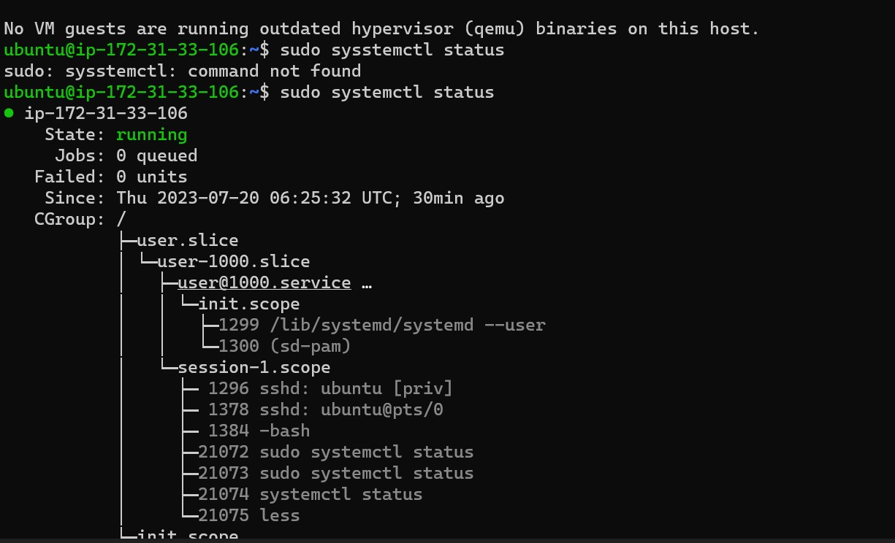

*Node.js software location*

`curl -fsSL https://deb.nodesource.com/setup_18.x | sudo -E bash -`

*Install Node.js*

`sudo apt-get install -y nodejs`

*Verify Node.js*

`node -v`

`npm -v`

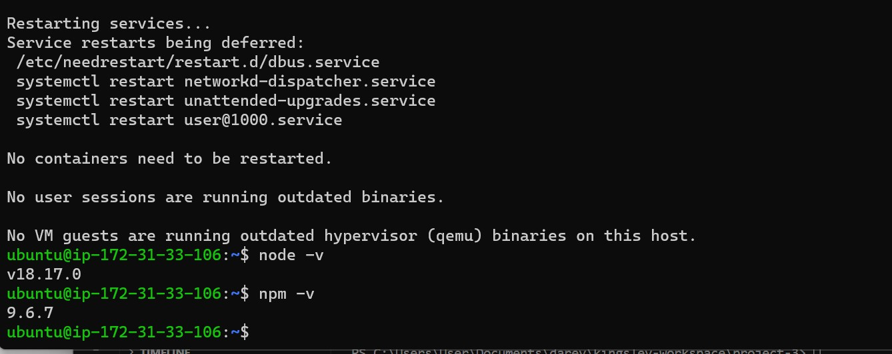

*Application Code Setup - Create a new directory for your To-Do project:*

`mkdir Todo`

`ls`

`ls -lih`

`cd Todo`

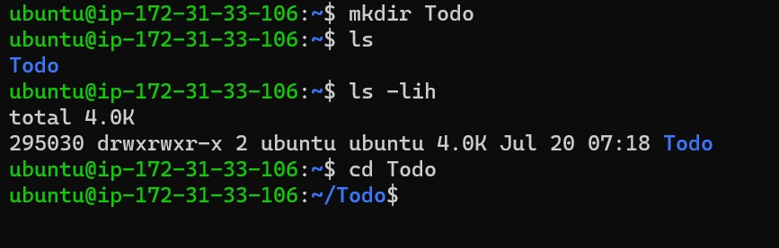

*Initialize Project*

`npm init`

`ls`

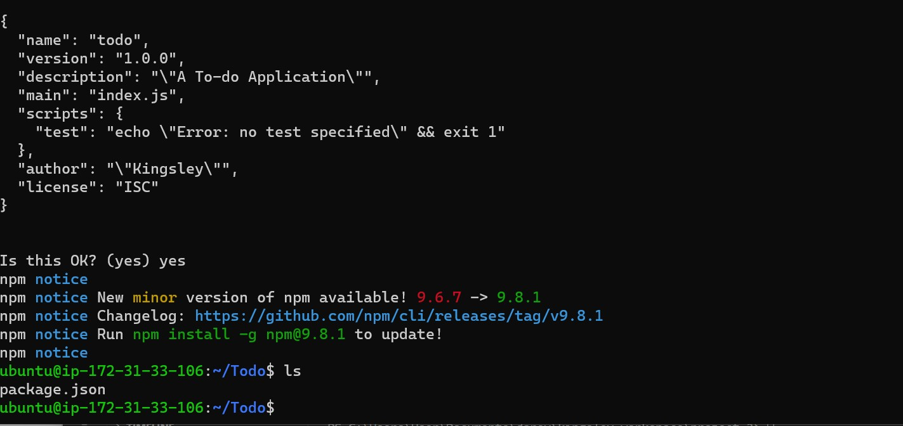

### Step 2 - Install Express JS

*Install it using npm*

`npm install express`

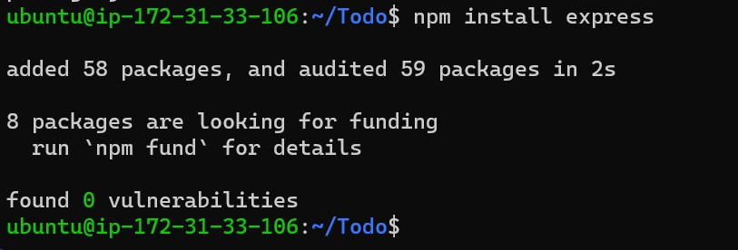

*create file*

`touch index.js`

`ls`

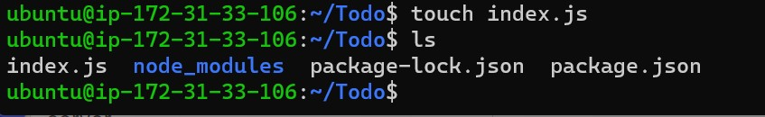

*Install dotenv*

`npm install dotenv`

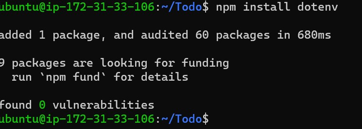

*Open the index.js file with the command below*

`vim index.js`

*Start server*

`node index.js`

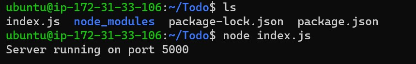

*Access server on browser on port 5000*

`http://<PublicIP-or-PublicDNS>:5000`

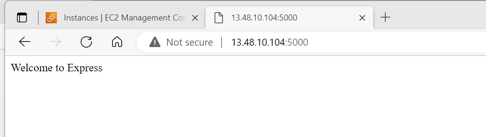

*Creating routes*

`mkdir routes`

`cd routes`

*create a file api.js*

`touch api.js`

*Open the file with the command below*

`vim api.js`

### Step 3 - Models

*Install Mongoose*

`npm install mongoose`

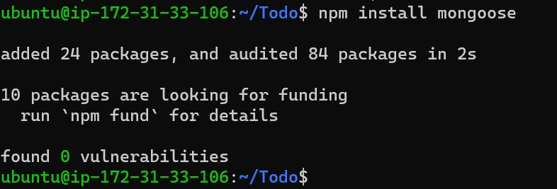

*Create a new folder models*

`mkdir model`

`cd model`

`mkdir model && cd model && touch todo.js`

`vim todo.js`

### Step 4 - MongoDB Database

*Create a file in your Todo directory and name it .env*

`touch .env`

`vi .env`

*Add the connection string to access the database*

`DB = 'mongodb+srv://<username>:<password>@<network-address>/<dbname>?retryWrites=true&w=majority'`

*Update the index.js to reflect the use of .env*

`vim index.js`

*Start your server using the command*

`node index.js`

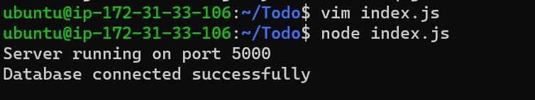

*Testing Backend Code without Frontend using RESTful API*

*create a POST request on Postman to the API*

`http://<PublicIP-or-PublicDNS>:5000/api/todos.`

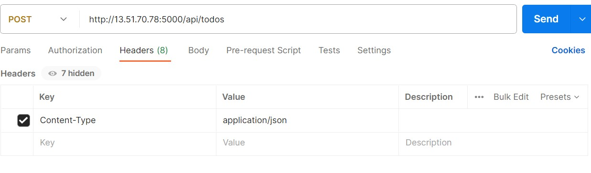

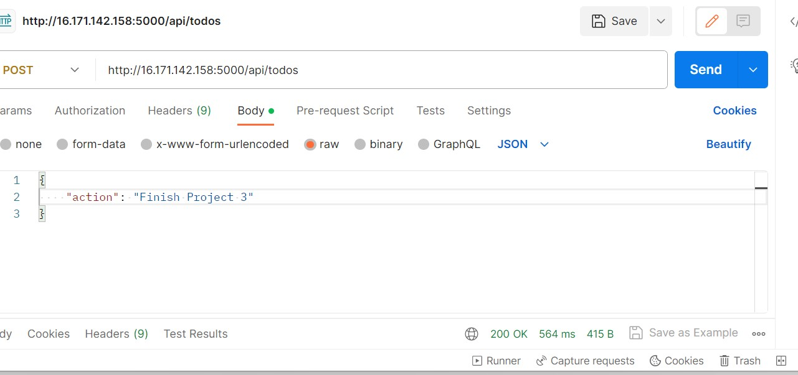

*Perform a GET request on Postman to the API*

`http://<PublicIP-or-PublicDNS>:5000/api/todos.`

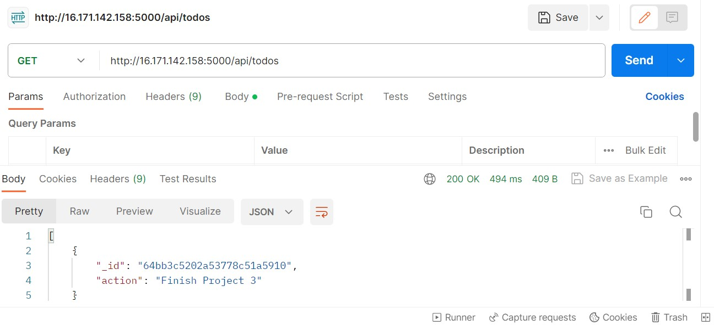

*Perform a DELETE request on Postman to the API*

To delete a task – i sent the ID as a part of DELETE request

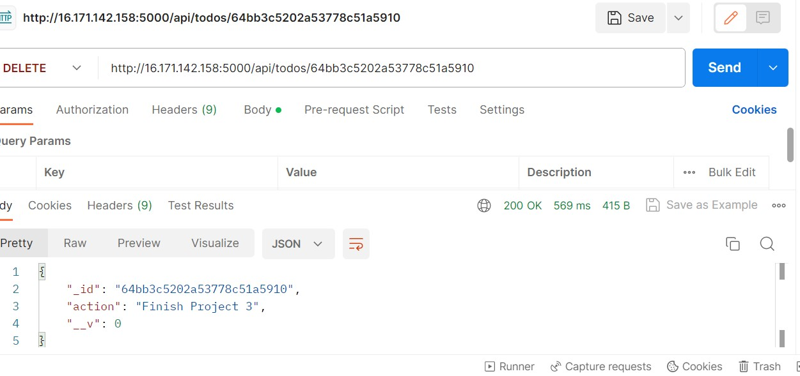

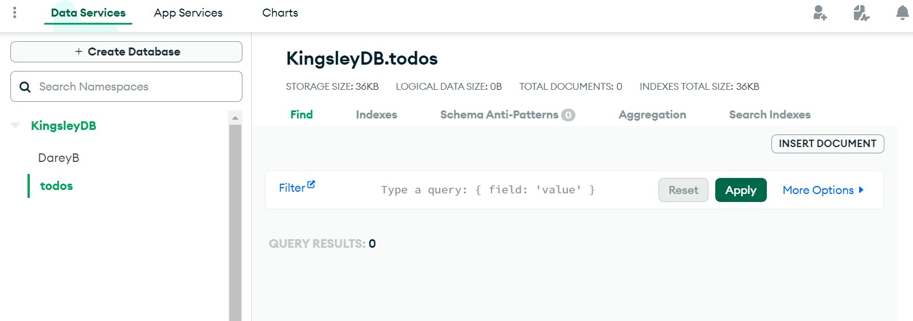

