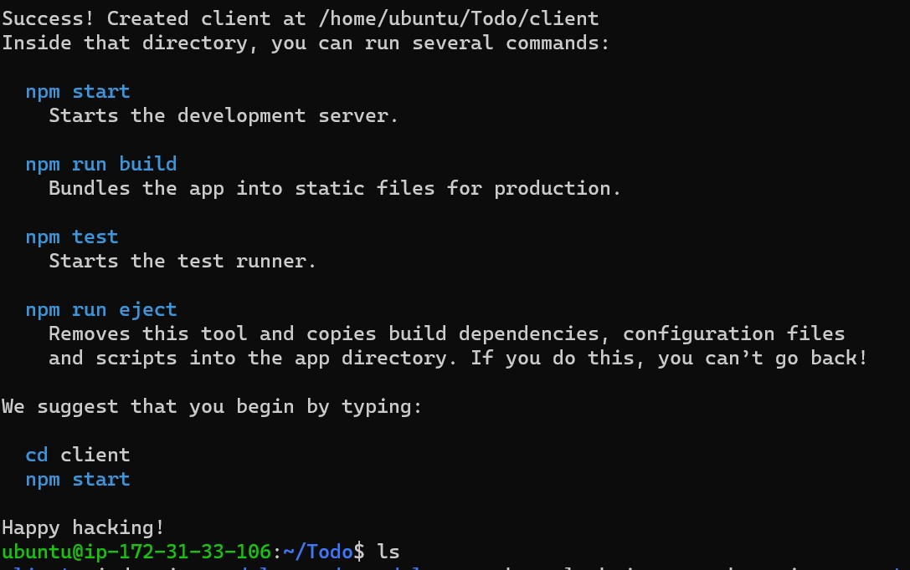
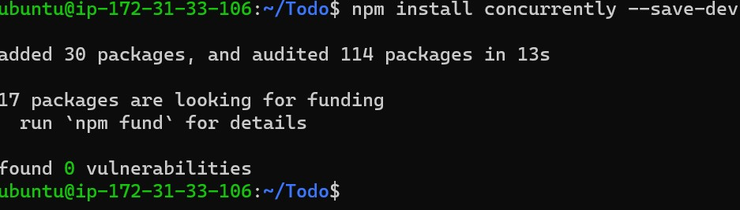
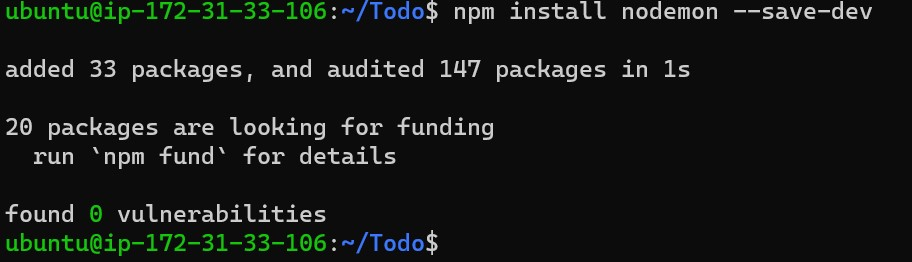
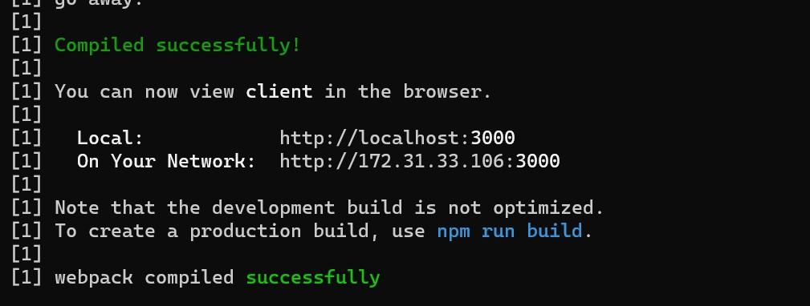
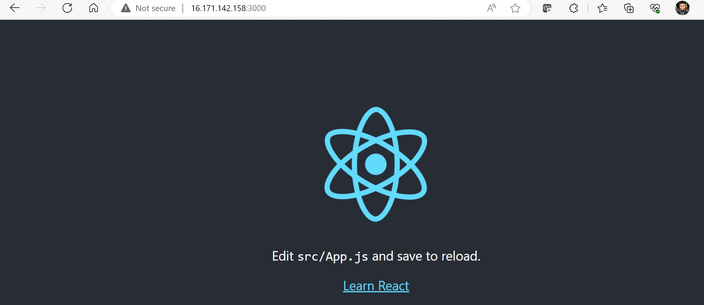
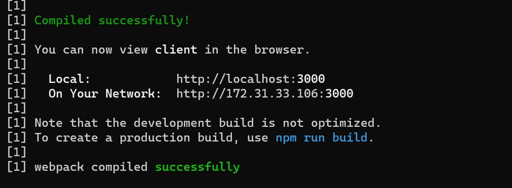
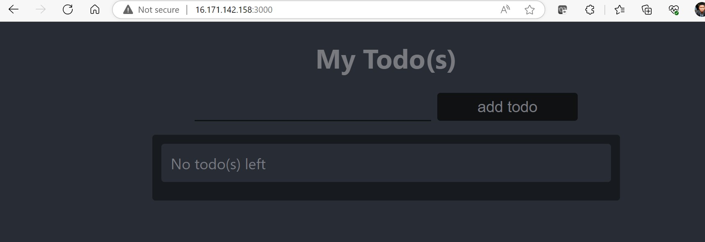

## Step 1 - Backend Configuration

*Update ubuntu*

`sudo apt update`

*Upgrade ubuntu*

`sudo apt upgrade`

*Ubuntu Status*

`sudo systemctl status`

*Node.js software location*

`curl -fsSL https://deb.nodesource.com/setup_18.x | sudo -E bash -`

*Install Node.js*

`sudo apt-get install -y nodejs`

*Verify Node.js*

`node -v`

`npm -v`

*Application Code Setup - Create a new directory for your To-Do project:*

`mkdir Todo`

`ls`

`ls -lih`

`cd Todo`

*Initialize Project*

`npm init`

`ls`

### Install Express JS

*Install it using npm*

`npm install express`

*create file*

`touch index.js`

`ls`

*Install dotenv*

`npm install dotenv`

*Open the index.js file with the command below*

`vim index.js`

*Start server*

`node index.js`

*Access server on browser on port 5000*

`http://<PublicIP-or-PublicDNS>:5000`

*Creating routes*

`mkdir routes`

`cd routes`

*create a file api.js*

`touch api.js`

*Open the file with the command below*

`vim api.js`

### Models

*Install Mongoose*

`npm install mongoose`

*Create a new folder models*

`mkdir model`

`cd model`

`mkdir model && cd model && touch todo.js`

`vim todo.js`

### MongoDB Database

*Create a file in your Todo directory and name it .env*

`touch .env`

`vi .env`

*Add the connection string to access the database*

`DB = 'mongodb+srv://<username>:<password>@<network-address>/<dbname>?retryWrites=true&w=majority'`

*Update the index.js to reflect the use of .env*

`vim index.js`

*Start your server using the command*

`node index.js`

*Testing Backend Code without Frontend using RESTful API*

*create a POST request on Postman to the API*

`http://<PublicIP-or-PublicDNS>:5000/api/todos.`

*Perform a GET request on Postman to the API*

`http://<PublicIP-or-PublicDNS>:5000/api/todos.`

*Perform a DELETE request on Postman to the API*

To delete a task – i sent the ID as a part of DELETE request

## Step 2 - Frontend Creation

*create a user interface for a Web client (browser) to interact with the application via API*

`npx create-react-app client`

*Running a React App*

Before testing the react app, there are some dependencies that need to be installed.

Install concurrently

`npm install concurrently --save-dev`

Install nodemon

`npm install nodemon --save-dev`

In Todo folder open the package.json file

`vi package,json`

Change the highlighted part with the below

`"scripts": {
"start": "node index.js",
"start-watch": "nodemon index.js",
"dev": "concurrently \"npm run start-watch\" \"cd client && npm start\""
},`

`cd client`

Open the package.json file

`vi package.json`

Add the key value pair in the package.json file

`"proxy": "http://localhost:5000"`

Ensured i was inside the Todo directory, and simply did:

`npm run dev`

In order to be able to access the application from the Internet i had to open TCP port 3000 on EC2 by adding a new Security Group rule. 

*Creating your React Components*

From your Todo directory run

`cd client`

`cd src`

Inside your src folder create another folder called components

`mkdir components`

`cd components`

Inside ‘components’ directory create three files Input.js, ListTodo.js and Todo.js.

`touch Input.js ListTodo.js Todo.js`

`vi Input.js`

To make use of Axios, which is a Promise based HTTP client for the browser and node.js, you need to cd into your client from your terminal and run yarn add axios or npm install axios.

`cd ..`

`cd ..`

Install Axios

`npm install axios`

Go to ‘components’ directory

`cd src/components`

After that open your ListTodo.js

`vi ListTodo.js`

After that open your Todo.js

`vi Todo.js`

We need to make little adjustment to our react code. Delete the logo and adjust our App.js to look like this.

Move to the src folder

`cd ..`

`vi App.js`

In the src directory open the App.css

`vi App.css`

In the src directory open the index.css

`vim index.css`

`cd ../..`

When you are in the Todo directory run:

`npm run dev`

